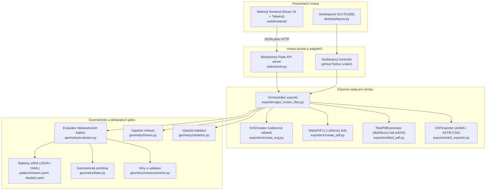

# Architektura systému

## 1. Celkový přehled architektury

JPPatternCreator je navržen jako vrstvený, modulární systém, který striktně odděluje matematické výpočty střihů od prezentační vrstvy a výstupních exportů.

---

## 2. Architektonická rozhodnutí a principy

### Bezstavový server (Strategie 1)
- **Důvod**: Tělesné rozměry zákazníků představují citlivé osobní údaje (PII). Ukládání měr do centrální databáze na serveru přináší bezpečnostní rizika a zátěž spojenou s GDPR.
- **Implementace**:
  - Flask backend není připojen k žádné databázi.
  - Každý požadavek na výpočet obsahuje kompletní stav (míry, polohy posuvníků, typ oděvu, vybraný díl).
  - Server zpracuje výpočet v paměti nebo v izolovaném dočasném souboru v `tempfile.gettempdir()` s unikátním UUID a po odeslání výstupu jej ihned smaže.
  - Klientské profily jsou uloženy výhradně v prohlížeči uživatele (`localStorage` a `IndexedDB`).

### Deklarativní rozšiřitelnost (přidávání střihů bez zásahu do kódu)
- **Důvod**: Historické oděvy mají desítky variant a střihových modifikací. Zapisovat každou variantu napevno do Python kódu je neudržitelné.
- **Implementace**:
  - Všechny vzorce, konstrukční body, křivky, švové přídavky i vázací dírky jsou zapsány v deklarativních šablonách v YAML/JSON ([Specifikace](pattern_definition_spec.md)).
  - Python jádro šablonu načte, topologicky vyhodnotí vzorce a sestaví vektorovou geometrii.

### Čtyřúrovňová exportní pipeline
- **1:1 Plotrové PDF**: Spojitý tisk pro velkoformátové plotry na role papíru v ateliéru.
- **Dlaždicové PDF (A4/A3)**: Rozřezání do mřížky stránek s přesahy na slepení pro běžné kancelářské tiskárny.
- **Vektorové SVG**: Čisté křivky ve vrstvách pro grafické editory (Inkscape, Illustrator).
- **CAD DXF**: Průmyslový standard AAMA/ASTM pro automatické CNC stříhací stoly.

### Centralizovaná konfigurace (`config.py`)
- Rozměry plátna (`PAPER_WIDTH_CM = 120`, `PAPER_HEIGHT_CM = 160`), rozlišení (`SVG_SCALE = 4`), odsazení a systémové cesty jsou centralizovány v `config.py`.
